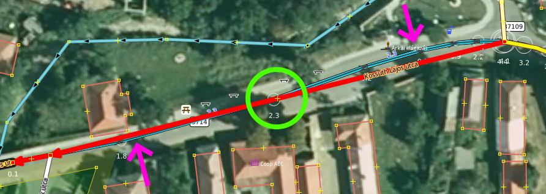

# osm-smoothie

JOSM parancsfájl OSM vonalak referenciához igazítására

## Telepítés

1. A JOSM alá telepíteni kell a "scripting" bővítményt.

2. Le kell tölteni, és a JOSM könyvtárba kicsomagolni a [GraalJS](https://github.com/oracle/graaljs) JavaScript motort. 
Nekem voltak gondjaim a 23-as JDK alatt a 23-as GraalJS futtatásakor, de ugyanez 21-es JDK-val teljesen jól működik.

3. A "scripting" bővítmény a JOSM Beállítások alá létre fog hozni egy *Parancsfájlkezelés* lapot.  Itt a *GraalVM* / *ES Module repositories* fülön hozzá kell adnunk egy könyvtárat, ahol a JavaScript moduljainkat tárolni akarjuk.

4. Ebbe a könyvtárba töltsük le és csomagoljuk ki az osm-smoothie-t (az alkönyvtár nevét megtartva)!

## Használat előtt

Vegyük fel a kedvenc rétegeinket! Kötelező valamelyik FÖMI (hiszen ehhez ellenőrizzük az igazítást). Még ott szokott lenni az Esri és a Bing is, hogy frissebb állapotokra is rá tudjak nézni. És persze az OpenStreetMap Carto.

Utak pontosításakor én fel szoktam még venni a Magyar Közút WMS réteget, illetve az ettől való eltéréseket színező mk_diff-et.

Végül szintén kötelező betölteni a referencia réteget, ami közutak esetén a NAP portálról letöltött KML. (Azért ez, mert ez már WGS84-ben van.)

&#x25B6; Egy minta munkamenet megtalálható a [sample/mk.joz](sample/mk.joz) állományban.

### Beállítások

A `main.js` elején találhatók a beállítások. Ezek:

* `RefName`: A referencia réteg neve
* `RefTag`: A referenciában annak a mezőnek a neve, ami az OSM-ben a `ref`
* `WorkName`: A munka réteg neve
* `BufferWidth`: A letöltésnél a referencia körüli sáv szélessége méterben
* `MaxArea`: Letöltésnél az egy kéréssel letölthető maximális terület, négyzetkilométerben. Az OSM API elvileg az itteni alapértelmézésnél jóval nagyobbat is engedne, de a területből kilógó hosszú vonalak, kapcsolatok miatt jobb az óvatosság.
* `SnapRadius`: Az algoritmus hány méteren belül húzzon rá egy töréspontot a referencia közeli töréspontjára?
* `MaxDistance`: A referenciához képesti maximális eltérés, méterben
* `MinSegmentLength`: Ívek közelítésekor egy-egy tört szakasz minimális hossza, méterben (még ha így az eltérés `MaxDistance`-nál nagyobb is marad)
* `Variance`: A „kézremegés” mértéke, méterben

## Futtatás

1. A referencia rétegen kiválasztjuk a pontosításra szánt vonalat. Ez lehet csak egy törtvonal, de célszerűbb lehet a *Keresés* funkcióval az összes adott számú vonalat kiválasztani (persze nem a fél országon átmenő utak esetén).

2. Parancskonzol / Futtat. Itt első alkalommal ki kell választanunk a `main.js` állományt, utána már ott lesz a menüben. Akár billentyűkombinációt is rendelhetünk hozzá.

3. Mérettől függően pár másodperc (max. perc) múlva megkapjuk az igazított OSM vonalakat.

4. Ezt végignézzük (ennek okairól alább bővebben) elejétől végéig.

5. Adatok feltöltése, az ellenőrzési hibák javítása, majd a tényleges feltöltés.

6. GO TO 1.

## Végignézés

**Nagyon fontos, hogy feltöltés előtt végignézd és ellenőrizd a futtatás eredményét!**

Ha erre nem lenne szükség, automatizáltam volna az egész folyamatot. Az alábbiakban mutatok néhány tipikus példát, miért kell emberi közreműködés.

### Igazítás az út mentén

Az algoritmus a referenciához merőleges irányban hozza be a pontokat, és szándékosan nem foglalkozik azzal, hogy egy becsatlakozó út miatt esetleg az út irányában is el kellene tolni. A képen az  5708-as pontosítása történik, és az 57121-es marad eltolva.

Én jelentős elcsúszás esetén a pontosított útba ágazó alsóbbrendű utakat is helyre szoktam húzni.

### S-kanyar

Az OSM-es töréspontok igazításán túl az algoritmus a szakaszok felezőpontján végez ellenőrzést, hogy kell-e köztes pontot beszúrni. A képen látható enyhe S-kanyar esetén viszont örül, mert a felezőpont épp ráesik a referenciára. Ezért a nyilakkal jelzett helyeken pontatlan marad. Teljesítmény optimalizálásból *egyelőre* nem raktam be több részre történő felosztást.

### Utak csatlakozása

Szegény algoritmust teljesen megvezeti, ha az utak csatlakozása nem T topológiájú (hanem pl. háromszög, kétirányú ágakkal), viszont a referencia egy vonallal csatlakozik be. A képen a felső, átlós ág pontjait sikerült a vízszintes ágra húzni, ahol a referencia csatlakozik.

### Járdák

A pontosítás csak a referencia útnak megfelelő OSM-es vonalat pontosítja. A vele párhuzamos objektumokat (járda, kerékpárút, szalagkorlát, zajvédő fal stb.) nem. Ezeket legalább annyira helyre kell rakni, hogy a keresztezéseket megszüntessük.

### „Éles szög”

Előfordul, hogy annyit kell igazítani az úton, hogy egy csatlakozó mellékutca pontja (pl. elsőbbségadás kötelező vagy STOP tábla) is a referencia túloldalán van. Ilyenkor a kereszteződés helyre húzása egy éles szögű törést fog eredményezni.

### A referencia hibája

Van, hogy a referencia „érdekes”. Az alábbi képen pl. a buszforduló hurka megszakad. Emiatt aztán az algoritmus a lila vonalról a pirosra húzta a pontokat.

### Átépítés

Van olyan is, ahol az út vonalvezetése megváltozott, de a referencia még a régit tartalmazza.

Ez persze fordítva is előfordul: A referencián nőtt egy új körforgalom az út közepére, amire az OSM-es egyenest kellene ráhúzni.

### És még mit nem?

Az algoritmus szándékosan kihagyja az egyirányú utakat és a körforgalmakat. Előbbieknél a leggyakoribb az OSM és MK közötti szemléletbeli eltérés (út csatlakozások, körforgalom ki-behajtók, pontosan mettől-meddig osztott pályák stb.). Utóbbiaknál pedig a becsatlakozó, de a referenciában nem szereplő utakat is meg kell igazítani.

Szintén szándékosan nem húzza a referenciára azokat az OSM-es utakat, ahol meg van adva a sávok száma, és ez páratlan, vagy nem egyezik a két irányban. Ez azért lényeges, mert az OSM-en az aszfalt közepét szoktuk térképezni, míg a Magyar Közút a két irányt elválasztó vonalat.

### És még

Az igazítás ellenőrzése egyben jó alkalom arra, hogy az utak besorolását (a számozott szakasz végét) is ellenőrizzük. Tipikusan az ötszámjegyű bekötő utaknál szokott előfordulni, hogy a logikusnak tűnő kereszteződéshez képest a semmi közepén ér véget a számozott közút.
